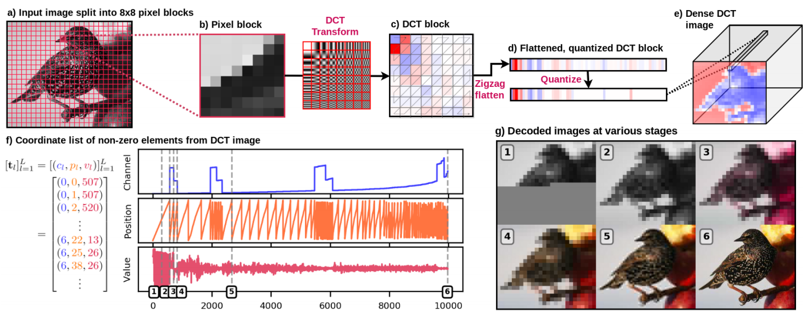
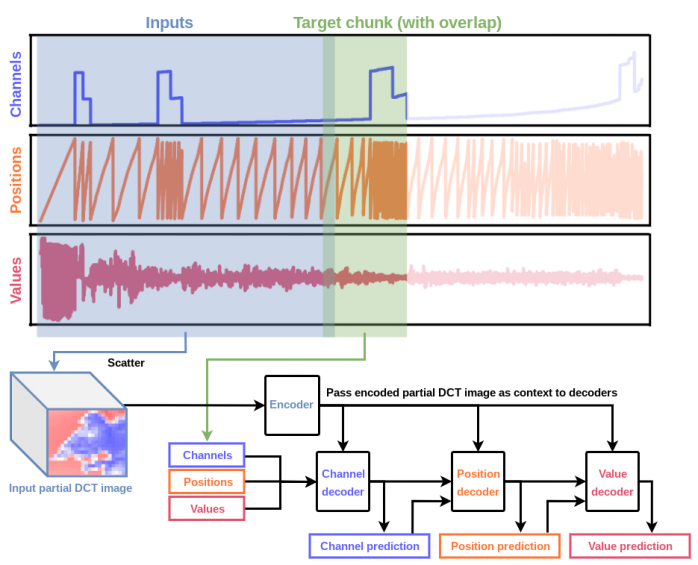

## Unofficial PyTorch implementation of the paper "[Generating images with sparse representations](https://arxiv.org/abs/2103.03841)"

### Paper Abstract

The high dimensionality of images presents architecture and sampling-effificiency challenges for likelihood-based generative models. Previous approaches such as VQ-VAE use deep autoencoders to obtain compact representations, which are more practical as inputs for likelihood-based models. We present an alternative approach, inspired by common image compression methods like JPEG, and convert images to quantized discrete cosine transform (DCT) blocks, which are represented sparsely as a sequence of DCT channel, spatial location, and DCT coeffificient triples. We propose a Transformer-based autoregressive architecture, which is trained to sequentially predict the conditional distribution of the next element in such sequences, and which scales effectively to high resolution images. On a range of image datasets, we demonstrate that our approach can generate high quality, diverse images, with sample metric scores competitive with state of the art methods. We additionally show that simple modififications to our method yield effective image colorization and super-resolution models.





### Usage

```bash
git clone https://github.com/wushidiguo/DCTransformer.git
cd DCTransformer
```

```python
from dctransformer.trainer import run

run(
    your_image_folder, 
    model_save_path,
    with_cuda = True,
    batch_size=128, 
    resolution=(128, 128), 
    block_size=8, 
    q=50, 
    interleave=True, 
    chunk_size=896, 
    overlap_size=128, 
    max_nchunk=10, 
    encoder_downsample=2, 
    nlayer=3, 
    d_model=512, 
    nheads=8,
    dropout=0.1,
    start_lr=5e-4,
    max_lr=0.1,
    warmup=1000,
    tokens_to_process=1e9,
    log_interval=100
)
```

See `demo.ipynb` for more examples.

### Differences with paper

- Common transformer is used  for convenience instead of PAR-Transformer used in the paper.

- Training trunks sampling policy is simplified.

### References

- [benjs's code](https://github.com/benjs/DCTransformer-PyTorch/blob/main/dctransformer/transforms.py).

- [this blog](http://nlp.seas.harvard.edu/annotated-transformer/) provides very good tutorial on transformer.

- [this wiki page](https://en.wikipedia.org/wiki/JPEG#JPEG_codec_example) has a thorough description over jepg compression.
